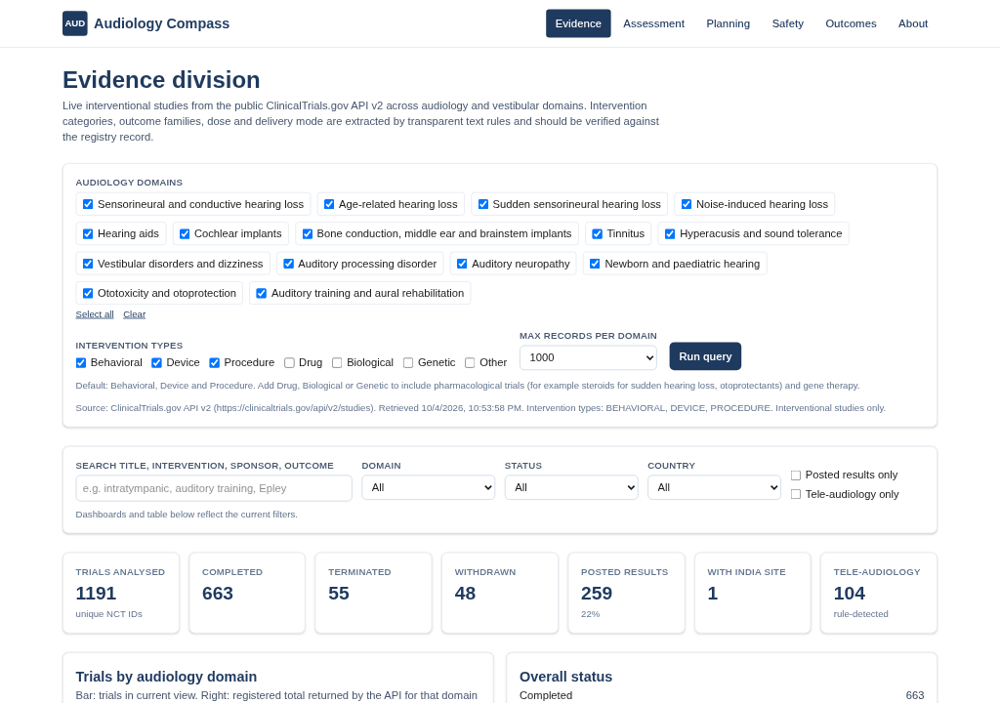

# Audiology Compass

**An open web platform for evidence-guided audiology practice.**

A human-guided, multi-division web tool for audiologists and hearing and balance researchers. Inspired by the
Virtual Biotech framework (Zhang et al., *Science*, 2026), in which AI agents are organised like the divisions of an
organisation and a human expert stays in charge.

> Educational and research use only. Not a medical device. Not a substitute for clinical judgment.

**Live app:** https://audiologycompass.vercel.app

**Sister tool:** [SLP Compass](https://slpcompass.vercel.app) for speech-language pathology ([source](https://github.com/Hemaraja9994/slp-compass)).

[](https://vercel.com/new/clone?repository-url=https://github.com/Hemaraja9994/audiology-compass)



## Purpose

Audiology intervention research spans devices, drugs, surgery, behavioural therapy and service models, and is spread
across many registries and reports. Audiology Compass gives clinicians and students a single, free place to:

- explore registered audiology and vestibular trials live from ClinicalTrials.gov;
- plot audiograms and compute common audiometric values without sending data anywhere;
- draft ICF-based aural rehabilitation, tinnitus and vestibular goals;
- review red flags for urgent and medical referral;
- track aided and unaided outcomes with participant codes only.

## Divisions (features)

| Division | What it does |
| --- | --- |
| **Evidence** | Queries the public [ClinicalTrials.gov API v2](https://clinicaltrials.gov/data-api/api) through a Next.js server route for 15 domains: sensorineural and conductive hearing loss, age-related hearing loss, sudden sensorineural hearing loss, noise-induced hearing loss, hearing aids, cochlear implants, bone conduction / middle ear / brainstem implants, tinnitus, hyperacusis and sound tolerance, vestibular disorders and dizziness (BPPV, vestibular neuritis, Meniere disease and more), auditory processing disorder, auditory neuropathy, newborn and paediatric hearing, ototoxicity and otoprotection, auditory training and aural rehabilitation. Interventional studies only. Rule-based tags for intervention category (hearing aid, cochlear implant, vestibular rehabilitation, repositioning, systemic or intratympanic steroid, hyperbaric oxygen, otoprotectant, gene or cell therapy, surgery and more), primary outcome family (pure-tone thresholds, speech in quiet and noise, tinnitus and dizziness questionnaires, datalogging, electrophysiology), dose, delivery mode (tele-audiology, app, over-the-counter or self-fitting, group, home) and population. Dashboards by domain, status, country (India highlighted), stop reasons, phase; filterable table; CSV export; optional bring-your-own-key AI annotation agent with a clinician verification checkbox. |
| **Assessment** | In-browser calculators: audiogram entry and plotter (ASHA 1990 symbols, right red O, left blue X, masked triangle and square, bone conduction < > [ ], no-response arrows, 250 to 8000 Hz, inverted dB HL axis) with PNG download and print; pure-tone averages (0.5/1/2 kHz, 0.5/1/2/4 kHz, configurable high-frequency average, Fletcher two-frequency average); degree of hearing loss by WHO 2021 grades (World Report on Hearing) or ASHA/Clark (1981) categories; air-bone gap pattern (configurable); interaural asymmetry check with labelled criteria (Rule 3000, Saliba et al. 2009, plus configurable rules); SRT-PTA agreement; AAO-1979 percentage hearing handicap (1.5% per dB over 25 dB HL, 0.5/1/2/3 kHz, binaural 5:1); Jerger tympanogram type helper with editable typical ranges (adult and child); ototoxicity change from baseline (ASHA 1994 criteria, optional extended high frequencies); hearing aid real-ear measured vs target difference table with configurable tolerances. No copyrighted questionnaire items are included (HHIE, THI, DHI, APHAB, COSI and others); only total scores are recorded in Outcomes. |
| **Planning** | ICF goal builder for aural rehabilitation, tinnitus and vestibular rehabilitation across Body Functions and Structures (b230, b2300 to b2304, b235, b2351, b240, b2400, b2401 and more), Activity (d115, d310, d350, d360, d450), Participation (d710 to d920) and Environmental factors (e125, e1251, e250, e310). Every suggested code was checked against the [WHO ICF browser](https://apps.who.int/classifications/icfbrowser/). Generates printable SMART goal text, with hearing, vestibular and tinnitus example sets. |
| **Safety** | Educational red-flag checklists: emergency signs (central vertigo, mastoiditis, necrotising otitis externa), sudden sensorineural hearing loss (urgent ENT referral; onset over 72 hours or less per the AAO-HNSF 2019 guideline), asymmetric or unilateral SNHL, pulsatile or unilateral tinnitus, central vs peripheral positional vertigo, ear disease, newborn and paediatric follow-up timelines (JCIH 2019 1-3-6 and 1-2-3) and ototoxic drug monitoring. Links only to verified sources. |
| **Outcomes** | Tracker stored only in browser localStorage, by participant code (validated, no spaces). Records ear and condition (unaided, aided, cochlear implant, bimodal, bone conduction) so aided vs unaided results plot as separate lines. Presets for thresholds, speech in quiet and noise, questionnaire totals and hearing aid data logging. CSV export, JSON backup and restore. |

### Evidence search choices

- Audiology trials often test drugs (for example steroids for sudden hearing loss, otoprotectants such as sodium
  thiosulfate) and procedures (implant surgery, repositioning manoeuvres). The intervention type filter therefore
  offers Behavioral, Device, Procedure, Drug, Biological, Genetic and Other. **The default is Behavioral + Device +
  Procedure**, which keeps the focus on audiological and rehabilitative care; add Drug, Biological or Genetic to
  include pharmacological, cell and gene therapy trials.
- Hearing aid, cochlear implant and implantable device domains search the intervention field (`query.intr`). The
  paediatric domain restricts to trials with a maximum age of 18 years or less. All query strings are shown on the
  Evidence page under "Queries used".

### Human in the loop

- Rule-based features show the text they matched so they can be checked.
- AI annotations are saved as **unverified** until a clinician ticks "Clinician verifies"; editing a field resets verification.
- The AI agent only receives public registry text and is instructed to answer "not reported" rather than guess.

### Optional AI annotation agent

- Works with any OpenAI-compatible `/chat/completions` endpoint (base URL and model are configurable).
- The API key is stored only in the browser's localStorage and sent only with each annotation request.
- **Relay mode** (default): the key is sent in a request header to `/api/annotate`, which fetches the trial from
  ClinicalTrials.gov, calls the endpoint once and returns a structured annotation. The key is never logged or stored.
  The relay only accepts public `https` base URLs.
- **Direct mode**: the browser calls the provider itself (the provider must allow CORS).

## Run locally

Requirements: Node.js 20.9 or later.

```bash
git clone https://github.com/Hemaraja9994/audiology-compass.git
cd audiology-compass
npm install
npm run dev        # http://localhost:3000
npm run lint
npm run build && npm start
```

Quick API check:

```bash
curl "http://localhost:3000/api/trials?domains=tinnitus,ssnhl&types=BEHAVIORAL,DEVICE,PROCEDURE,DRUG&max=1000"
```

### API routes

| Route | Purpose |
| --- | --- |
| `GET /api/trials?domains=tinnitus,ci&types=BEHAVIORAL,DEVICE,PROCEDURE&max=1000` | Live ClinicalTrials.gov query, de-duplicated across domains, with rule-based features. Domain ids: `snhl, arhl, ssnhl, nihl, hearingaids, ci, implants, tinnitus, hyperacusis, vestibular, apd, an, paeds, ototox, ar`. Types: `BEHAVIORAL, DEVICE, PROCEDURE, DRUG, BIOLOGICAL, GENETIC, OTHER`. Cached for 1 hour per server instance and via CDN headers. |
| `GET /api/trial-context?nct=NCT01234567` | Text-only context for one trial (used by direct-mode annotation). |
| `POST /api/annotate` | AI annotation relay. Body `{ nctId, baseUrl, model }`, header `x-llm-api-key`. |

No environment variables are required.

## Deploy to Vercel

Zero configuration: Vercel detects Next.js automatically. Use the button above, or import
`Hemaraja9994/audiology-compass` in Vercel (**Add New... > Project**) and deploy. The `/api/trials` and
`/api/annotate` routes set `maxDuration = 60` seconds, within the Hobby plan limits.

## Privacy

- No accounts, database, cookies for tracking, or analytics.
- No patient or client data is sent to or stored on the server.
- Assessment and planning inputs are processed in the browser only and are not saved; outcome data lives in browser localStorage on the user's device.
- The server only relays requests for public data to ClinicalTrials.gov (and, if the user opts in, to their chosen AI endpoint for public registry text).
- Use participant codes, never names, and follow institutional data protection rules.

## Disclaimer

Audiology Compass is for educational and research use only. It is not a medical device, does not diagnose or
recommend treatment, and does not replace clinical judgment, calibrated testing, local protocols or medical advice.
Registry data can be incomplete or outdated, and rule-based or AI extraction can be wrong: always check the source
record.

## Sources used in the calculators and checklists

- World Health Organization. World Report on Hearing. 2021. https://www.who.int/publications/i/item/9789240020481
- Clark JG. Uses and abuses of hearing loss classification. ASHA. 1981;23(7):493-500. PubMed 7052898.
- ASHA (1990). Guidelines for Audiometric Symbols. https://www.asha.org/policy/gl1990-00006/
- Saliba I, Martineau G, Chagnon M. Asymmetric hearing loss: rule 3,000 for screening vestibular schwannoma. Otol Neurotol. 2009;30(4):515-521. https://doi.org/10.1097/MAO.0b013e3181a5297a
- AAO and ACO. Guide for the evaluation of hearing handicap. JAMA. 1979;241(19):2055-2059. https://doi.org/10.1001/jama.1979.03290450053025
- Jerger J. Clinical experience with impedance audiometry. Arch Otolaryngol. 1970;92(4):311-324. https://doi.org/10.1001/archotol.1970.04310040005002
- ASHA (1994). Audiologic Management of Individuals Receiving Cochleotoxic Drug Therapy. https://www.asha.org/policy/gl1994-00003/
- Chandrasekhar SS, et al. Clinical Practice Guideline: Sudden Hearing Loss (Update). Otolaryngol Head Neck Surg. 2019;161(1 Suppl):S1-S45. https://doi.org/10.1177/0194599819859885
- Bhattacharyya N, et al. Clinical Practice Guideline: Benign Paroxysmal Positional Vertigo (Update). Otolaryngol Head Neck Surg. 2017;156(3 Suppl):S1-S47. https://doi.org/10.1177/0194599816689667
- Tunkel DE, et al. Clinical Practice Guideline: Tinnitus. Otolaryngol Head Neck Surg. 2014;151(2 Suppl):S1-S40. https://doi.org/10.1177/0194599814545325
- Joint Committee on Infant Hearing. Year 2019 Position Statement. J Early Hear Detect Interv. 2019;4(2):1-44. https://doi.org/10.15142/fptk-b748
- WHO ICF browser. https://apps.who.int/classifications/icfbrowser/

## Limitations (v1)

- Domain queries are keyword-based (ClinicalTrials.gov condition, intervention and term search) and can include
  off-target trials (for example migraine trials matched through sound sensitivity under hyperacusis) or miss trials
  described with other terms. Domain counts overlap; a trial can match more than one domain.
- Rule-based tags use regular expressions over registry text and can miss or misread values.
- Only ClinicalTrials.gov is searched; Indian trials registered only with CTRI are not included yet.
- Tympanogram ranges are typical starting values, not published norms; infants under about 6 months need 1000 Hz
  tympanometry, which is not covered. Asymmetry rules other than Rule 3000 are configurable screening options.
- Calculators do not interpolate missing frequencies and do not check masking adequacy.

## Roadmap

- CTRI (Clinical Trials Registry of India) integration alongside ClinicalTrials.gov.
- Masking calculator and plateau helper; speech audiometry plotting.
- Multi-agent annotation at scale with agreement checks and clinician adjudication.
- Kannada language support.

## Citation and credit

Inspiration: Zhang HG, Eckmann P, Miao J, Mahon AB, Zou J. The Virtual Biotech: A multi-agent AI framework for
therapeutic discovery and development. *Science*. 2026;eaeg6779. https://doi.org/10.1126/science.aeg6779

Author: **Hemaraja Nayaka S**, Associate Professor, Department of Audiology and Speech-Language Pathology,
Yenepoya Medical College, Yenepoya (Deemed to be University), Mangaluru, India.

This project is independent and not affiliated with the authors of the inspiration paper.

## License

[MIT](LICENSE)
